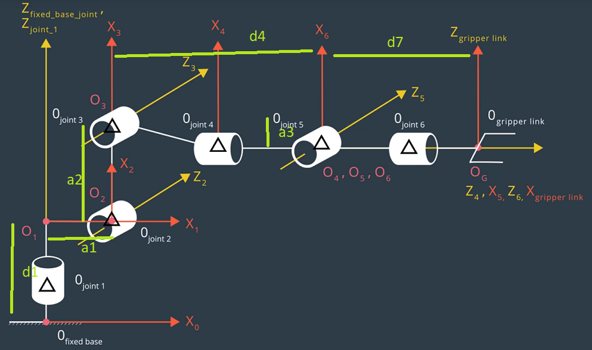

[](https://www.udacity.com/robotics)
# Robotic arm - Pick & Place project

**Steps to complete the project:**

1. Set up your ROS Workspace.
2. Download or clone the [project repository](https://github.com/udacity/RoboND-Kinematics-Project) into the ***src*** directory of your ROS Workspace.
3. Experiment with the forward_kinematics environment and get familiar with the robot.
4. Launch in [demo mode](https://classroom.udacity.com/nanodegrees/nd209/parts/7b2fd2d7-e181-401e-977a-6158c77bf816/modules/8855de3f-2897-46c3-a805-628b5ecf045b/lessons/91d017b1-4493-4522-ad52-04a74a01094c/concepts/ae64bb91-e8c4-44c9-adbe-798e8f688193).
5. Perform Kinematic Analysis for the robot following the [project rubric](https://review.udacity.com/#!/rubrics/972/view).
6. Fill in the `IK_server.py` with your Inverse Kinematics code.


## Writeup

### Kinematic Analysis

#### 1. Run the forward_kinematics demo and evaluate the kr210.urdf.xacro file to perform kinematic analysis of Kuka KR210 robot and derive its DH parameters as following:



i | alpha(i-1) | a(i-1) | d(i) | theta(i)
--- | --- | --- | --- | ---
1 | 0 | 0 | 0.75 | q1
2 | -pi/2 | 0.35 | 0 | -pi/2 + q2
3 | 0 | -1.25 | 0 | q3
4 |  -pi/2 | -0.054 | d4 | q4
5 | pi/2 | 0 | 0 | q5
6 | -pi/2 | 0 | 0 | q6
EE | 0 | 0 | 0.030 | 0

where:
* a(i) (link length) = the distance from Z(i) to Z(i+1) measured along X(i);
* alpha(i) (link twist) = the angle from Z(i) to Z(i+1) measured about X(i);
* d(i) (link offset) = the distance from X(i-1) to X(i) measured along Z(i); and
* theta(i) (joint angle) = the angle from X(i-1) to X(i) measured about Z(i).


#### 2. Using the DH parameter table you derived earlier, create individual transformation matrices about each joint. In addition, also generate a generalized homogeneous transform between base_link and gripper_link using only end-effector(gripper) pose.

The generalized Homogeneous Transformation matrix is defined as below:
```
        def T_mat(alpha, a, d, q):
                T = Matrix([[cos(q),              -sin(q),               0,           a             ],
                            [sin(q) * cos(alpha),  cos(q) * cos(alpha), -sin(alpha), -sin(alpha) * d],
                            [sin(q) * sin(alpha),  cos(q) * sin(alpha),  cos(alpha),  cos(alpha) * d],
                            [0,                    0,                    0,           1             ]])
                return T
```

The individual transformation matrices about each joint can be calculated by substituting the DH parameter into the generalized matrix.

For example:

substituting the parameter of link 1 into the generalized matrix,

i | alpha(i-1) | a(i-1) | d(i) | theta(i)
--- | --- | --- | --- | ---
1 | 0 | 0 | 0.75 | q1

The resultant homogeneous transformation matrix of link 1 w.r.t base frame, T0_1, is:

```
        T0_1 = Matrix([[cos(q1), -sin(q1), 0, 0   ],
                       [sin(q1),  cos(q1), 0, 0   ],
                       [0,        0,       1, 0.75],
                       [0,        0,       0, 1   ]])
```

The forward kinematic model, i.e. homogeneous transformation matrix of end-gripper w.r.t. base frame, can be found by composing those individual matrices as below:

```
        T0_EE = T0_1 * T1_2 * T2_3 * T3_4 * T4_5 * T5_6 * T6_EE
```

#### 3. Decouple Inverse Kinematics problem into Inverse Position Kinematics and inverse Orientation Kinematics; doing so derive the equations to calculate all individual joint angles.

The last three joints in Kuka KR210 are revolute joints, such a design is called a **spherical wrist** and the common point of intersection is call the **wrist center**. The advantage of such a design is that it kinematically decouples the position and orientation of the end effector. It is possible to independently solve two simpler problems: first, the Cartesian coordinates of the wrist center, and then the composition of rotations to orient the end effector.

i.e. This allows us to kinematically decouple the IK problem into Inverse Position and Inverse Orientation problems.

**Inverse Position**

We can find the angles of the first three joints (theta1, theta2, theta3) by solving the inverse position problem. First, computing the wrist center as below:

1. extracting end-effector position and orientation from request

```
        # Extract end-effector position and orientation from request
        # px,py,pz = end-effector position
        # roll, pitch, yaw = end-effector orientation
        px = req.poses[x].position.x
        py = req.poses[x].position.y
        pz = req.poses[x].position.z

        (roll, pitch, yaw) = tf.transformations.euler_from_quaternion(
                [req.poses[x].orientation.x, req.poses[x].orientation.y,
                 req.poses[x].orientation.z, req.poses[x].orientation.w])
```

2. obtaining the rotation matrix by given roll, pitch, and yaw and then correct the difference between the URDF and the DH reference frames for the end-effector

```
        R_corr = R_z(pi) * R_y(-pi/2)
        R_EE   = R_z(yaw) * R_y(pitch) * R_x(roll) * R_corr.transpose()
```

3. finding wrist center position

```
        nx, ny, nz = R_EE[:3, 2]

        wx = px - (d6 + d7) * nx
        wy = py - (d6 + d7) * ny
        wz = pz - (d6 + d7) * nz
```

Then, the angles can be calculated:

```
        theta1 = atan2(wy, wx)
```

As the following diagram, we can find the theta2 and theta3 by using cosine law


```
        A  = 1.50 # length of link 3 (=d4)
        B  = sqrt( (sqrt(wx**2 + wy**2) - a1)**2 + (wz-d1)**2 ) # length from O2 to WC
        C  = 1.25 # length of link 2 (a2)

        a = acos((B**2 + C**2 - A**2)/(2*B*C))
        b = acos((C**2 + A**2 - B**2)/(2*A*C))
        C = acos((A**2 + B**2 - C**2)/(2*A*B))
        d = atan2(wz-d1, sqrt(wx**2 + wy**2) - a1)

        theta2 = pi/2 - a - d
        theta3 = pi/2 - ( b + 0.036) # 0.036 accounts for sag in link4 of -0.054m
```

**Inverse Orientation**

Since the overall RPY rotation between base_link and gripper_link must be equal to the product of individual rotation between respective links.

```
        R0_6 = Rrpy
```

where,
Rrpy = Homogeneous RPY rotation between base_link and gripper_link as calculated above.

We can substitute the values we calculated for joints 1 to 3 in their respective individual rotation matrices and pre-multiply both sides of the above equation by inv(R0_3) which leads to:

```
        R3_6 = inv(R0_3) * Rrpy
```

The resultant matrix on the RHS (Right Hand Side of the equation) does not have any variables after substituting the joint angle values, and hence comparing LHS (Left Hand Side of the equation) with RHS will result in equations for joint 4, 5, and 6.

```
         r11, r12, r13 = R3_6[0,0], R3_6[0,1], R3_6[0,2]
         r21, r22, r23 = R3_6[1,0], R3_6[1,1], R3_6[1,2]
         r31, r32, r33 = R3_6[2,0], R3_6[2,1], R3_6[2,2]

         theta5 = atan2(sqrt(r13**2 + r33**2), r23)
         theta4 = atan2(r33, -r13)
         theta6 = atan2(-r22, r21)
```

### Project Implementation

#### 1. Fill in the `IK_server.py` file with properly commented python code for calculating Inverse Kinematics based on previously performed Kinematic Analysis. The robot can successfully complete 8/10 pick and place cycles.

